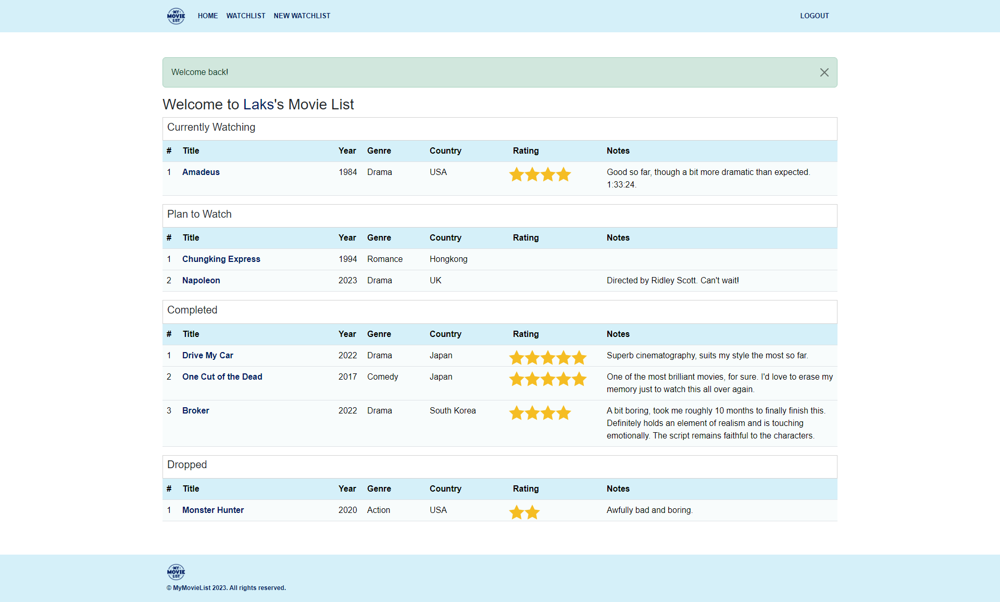
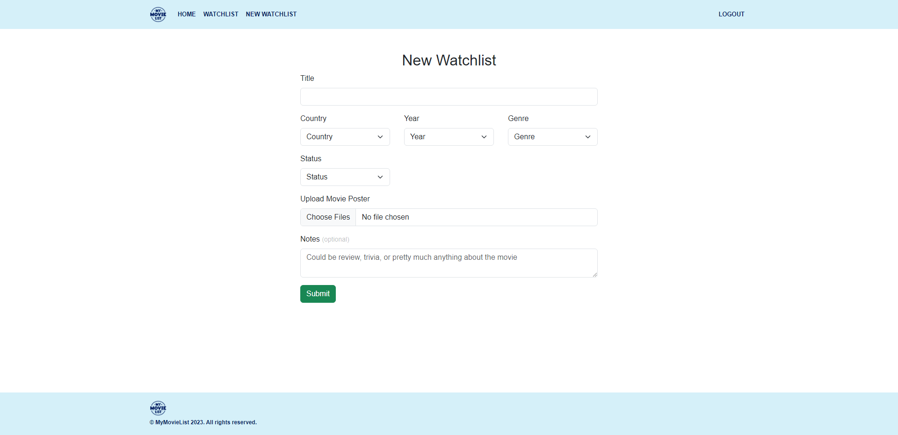

## Introduction

MyMovieList was born out of the frustration of the absence of a platform that contains both Western and Eastern movies while providing what I consider the most crucial aspect of a movie journey &ndash; personal note-taking. It's a straightforward website designed to help you plan the movies you want to watch, log the ones you've watched, and much more.

The demo can be accessed at [MyMovieList](https://mymovielist-2vxy.onrender.com/).

## Tech Stack

Basic CRUD application built with the following technologies:

-   MongoDB
-   ExpressJS
-   JQuery
-   NodeJS
-   Bootstrap
-   Cloudinary

## Preview

### Login Page

### Index Page

### Movie Page

### Create New Watchlist

### Edit A Watchlist

